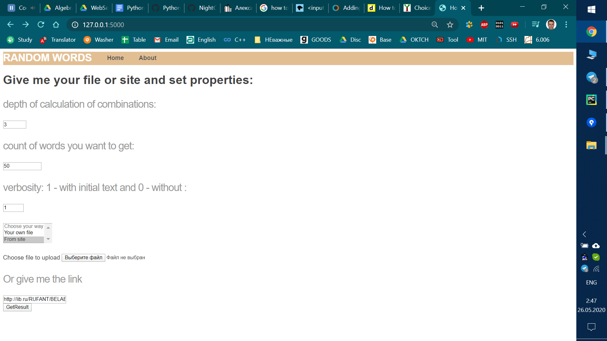

**version 1.0**

## Description

Using Python's Flask, HTML templates and PyDictionary API 

Windows 10

## Running from the command line

`python server.py`  
(It is python3 by default)

While program is running you can visit website:
http://127.0.0.1:5000/

There you'll see such window:

this is `home` page

on `about` page you can see smth about me and my project
on `home` page you get your combination of words

